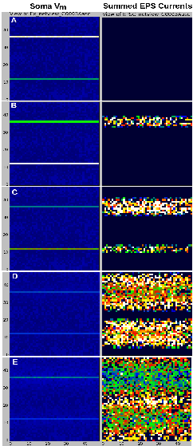

The ACnet2 model
----------------

This combined source code distribution and tutorial for the ACnet2 model
gives instructions for reproducing the simulation results shown in
Figure 1 of:

[Beeman D (2013) A modeling study of cortical waves in primary auditory
cortex. BMC Neuroscience, 14(Suppl 1):P23 doi:10.1186/1471-2202-14-S1-P23](http://www.biomedcentral.com/1471-2202/14/S1/P23).

Full details of this network model of layer IV of the primary auditory
cortex are contained in the tutorial/documentation for the ACnet2 GENESIS
model [ACnet2-docs.md](ACnet2-docs.html), which can be found in the
unpacked '.zip' or '.tar.gz' distribution of ACnet2-GENESIS.  It also
contains the CNS 2013 poster presentation of this work.

In addition to their scientific purpose, these simulation scripts were
developed as a tutorial example for the construction of realistic cortical
networks.  The simulation scripts are designed to be run with GENESIS 2.3
and are extensively commented, are easily customizable and are designed for
extension to more detailed models, or conversion to other simulation
systems.  The model is slowly being implemented in GENESIS 3 (G-3) and a
conversion to neuroConstruct (http://www.neuroconstruct.org/) is planned.
The scripts will be of particular interest to those GENESIS network
modelers who have not taken advantage of the ten-fold speed increase
available with the use of 'hsolve' for network simulations.

The optional GUI for the simulation allows many experiments and
variations of the model to be carried out without modifications.
This package also contains both GENESIS and simulator-independent Python
tools for the visualization and analysis of network activity.

If you do not use the GENESIS simulator, and would like to try out the
simulation, it is simplest to download the entire 'Ultimate GENESIS
Tutorial Distribution' package with all source code, installation
instructions, and the complete set of tutorials (about 50 MB) from
`http://genesis-sim.org/GENESIS/UGTD.html
<http://genesis-sim.org/GENESIS/UGTD.html>`_.  GENESIS usually installs
without problems under modern versions of Linux.  Most questions related to
installation have been answered in the archives of the 'genesis-sim-users'
mailing list, which are available from the GENESIS 2 Sourceforge page at
`http://sourceforge.net/projects/genesis-sim/
<http://sourceforge.net/projects/genesis-sim/>`_.

`ACnet2-docs.html <ACnet2-docs.html>`_ suggests experiments that may be
tried with the many configurable options in the scripts, and ways to extend
the model. It is my hope that this short tutorial and the example
simulation scripts can provide a head start for a graduate student or
postdoc who is beginning a cortical modeling project.

I encourage you to extend and share this tutorial/documentation and
simulation script package with others. The files here may be freely
distributed under the terms of the `GNU Lesser General Public License
version 2.1 <figures/copying.txt>`_.

David Beeman
University of Colorado, Boulder
dbeeman@colorado.edu
Tue Sep  3 12:03:30 MDT 2013

